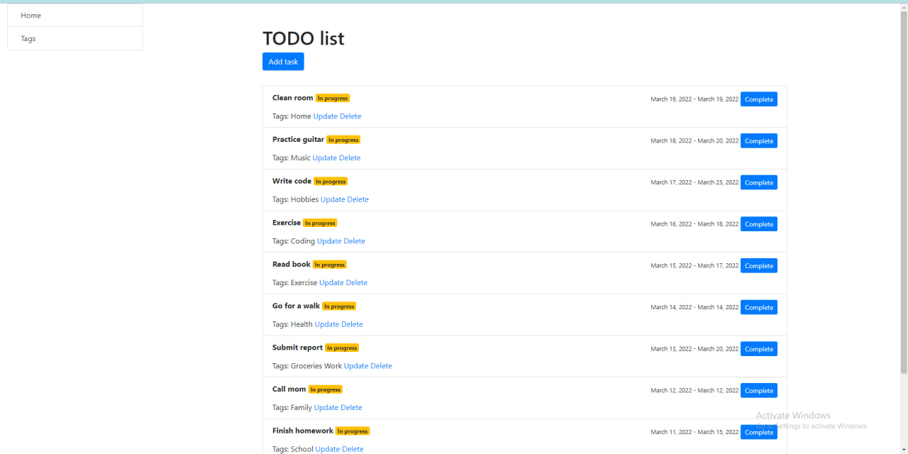

# TODO list

Django project for manging own time and activities

## Installation

Python3 and Django must be installed

```shell
git clone https://github.com/Dobryk12/to-do-list
python manage.py loaddata json_for_parcing.json  
pip install -r requirements.txt
python manage.py runserver
```

## Features
* Strong possibility to manage time
* Possibility to quickly load data
* Powerful admin panel 

## Demo


